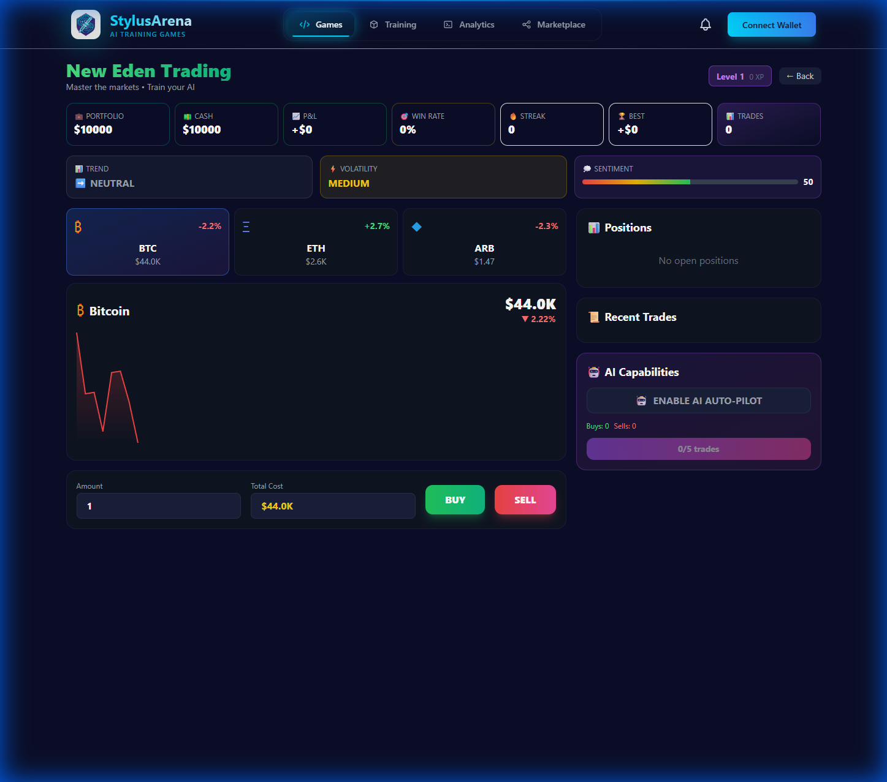
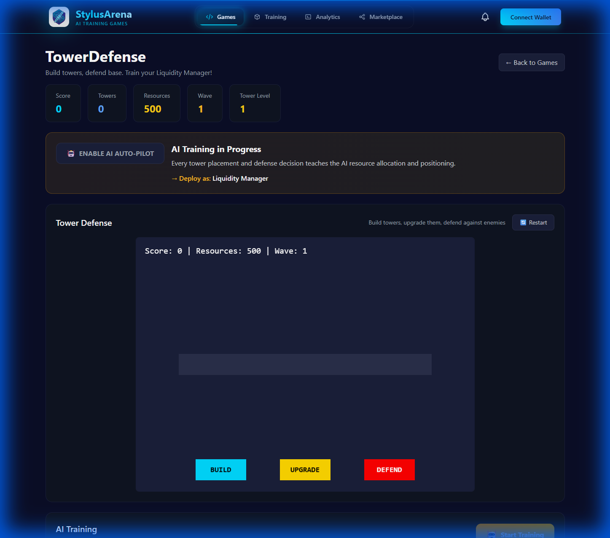
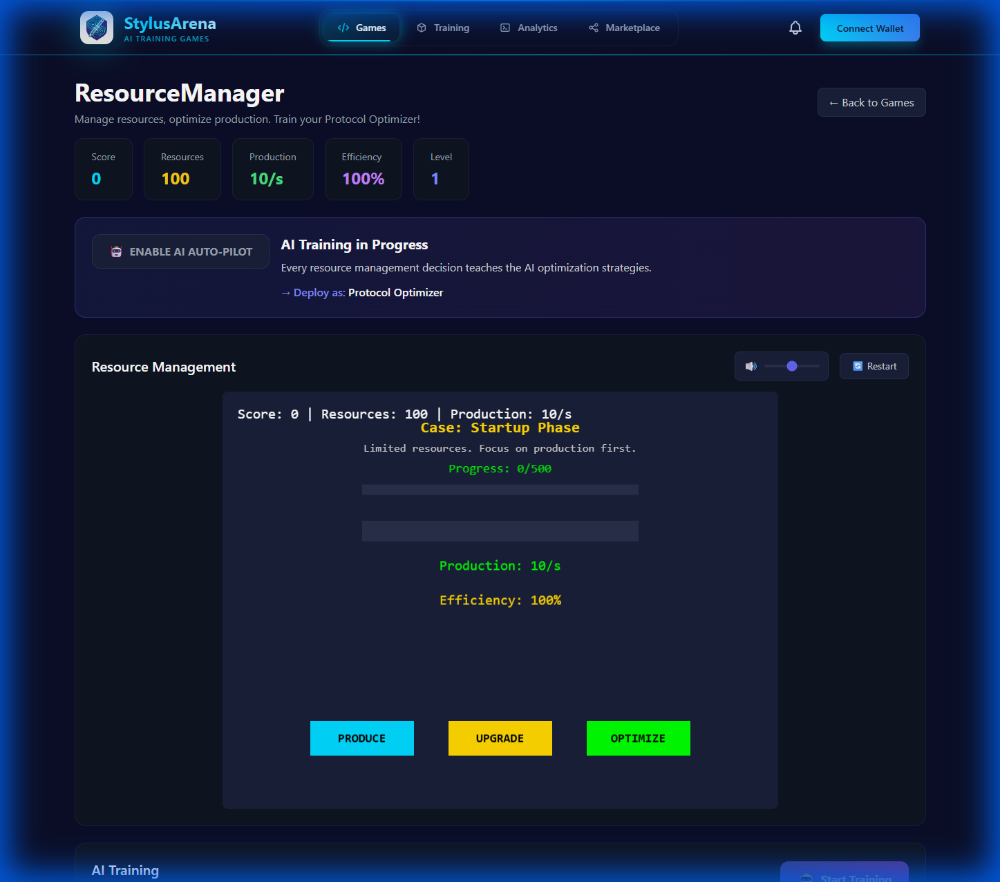
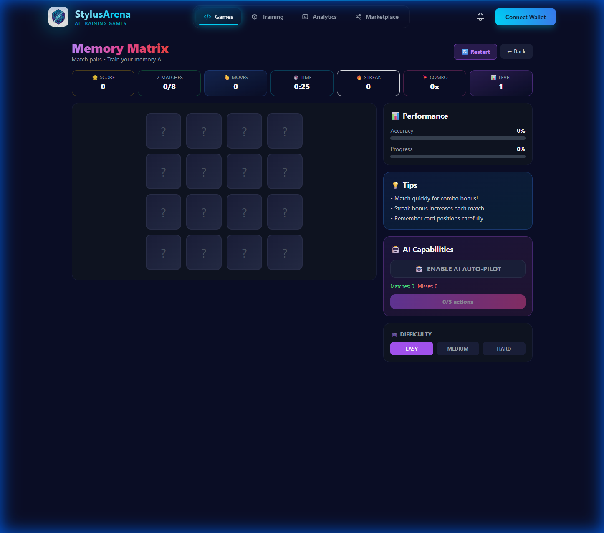
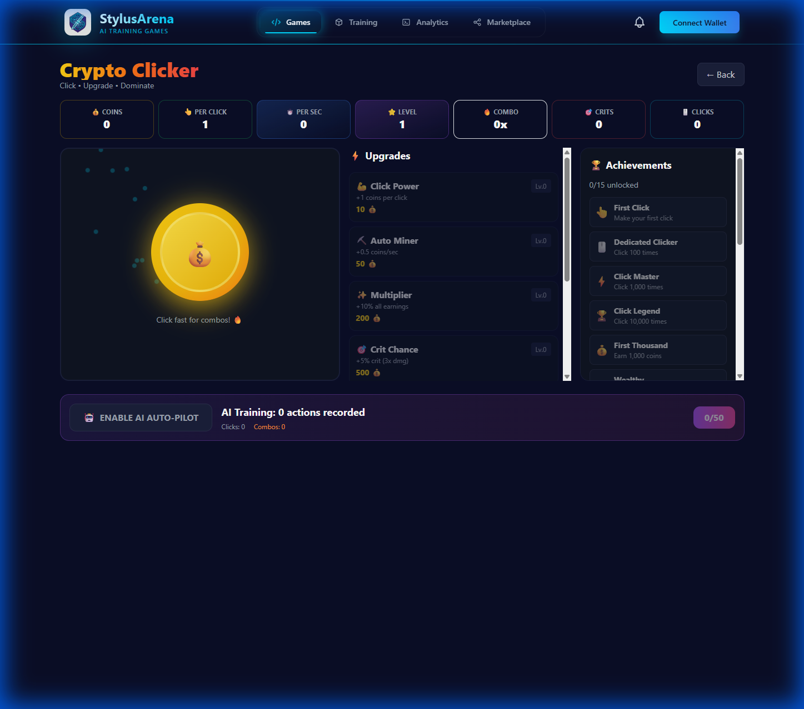
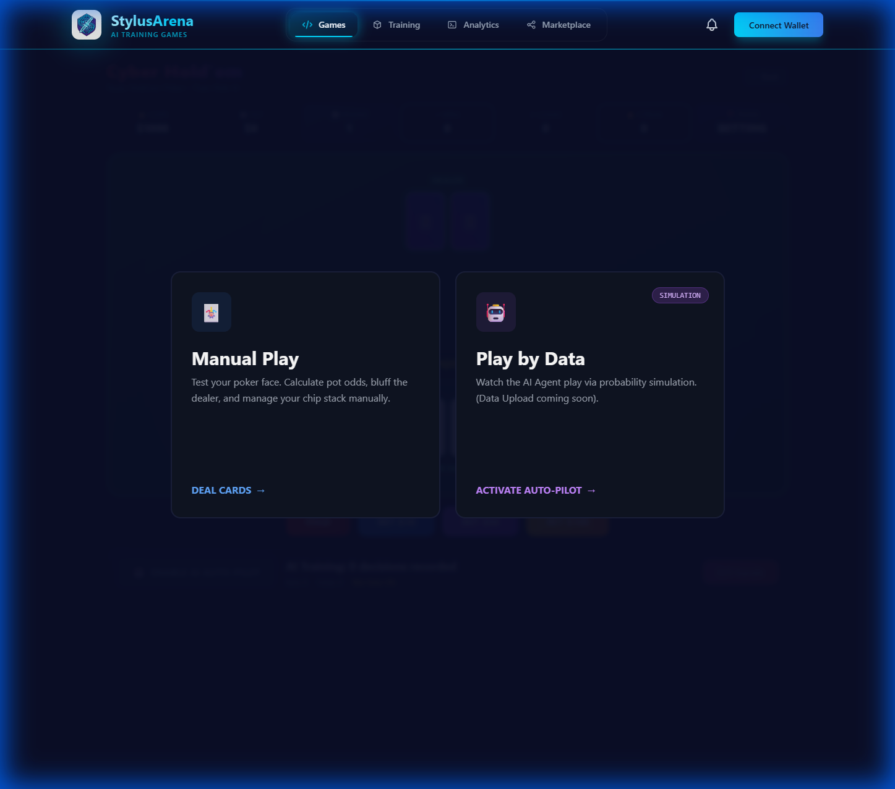

# 🎮 StylusArena

> **Gamified Policy Learning on Arbitrum Stylus**

[](https://arbitrum.io)
[](https://docs.arbitrum.io/stylus)
[](https://nextjs.org)
[](https://typescriptlang.org)
[](https://opensource.org/licenses/MIT)

<p align="center">
  
</p>

---

## 📋 Table of Contents

- [Overview](#-overview)
- [The Problem We Solve](#-the-problem-we-solve)
- [Key Features](#-key-features)
- [Game Library](#-game-library)
- [Real World Integration](#-real-world-integration)
- [Architecture](#%EF%B8%8F-architecture)
- [Tech Stack](#-tech-stack)
- [Smart Contracts](#-smart-contracts)
- [Getting Started](#-getting-started)
- [Project Structure](#-project-structure)
- [Environment Variables](#-environment-variables)
- [API & Contract Reference](#-api--contract-reference)
- [Screenshots](#-screenshots)
- [Roadmap](#-roadmap)
- [Team](#-team)
- [License](#-license)

---

## 🏆 Overview

**StylusArena** is a revolutionary **Gamified Policy Learning** platform that bridges the gap between **3 Billion Gamers** and **Decentralized Finance (DeFi)**.

We transform your natural gaming behavior into deployable AI agents that can execute real-world DeFi strategies on Arbitrum.

> *"Show me how you play Tower Defense, and I'll tell you how to manage your Liquidity Pool."*

---

## 🎯 The Problem We Solve

### The DeFi Complexity Crisis

| Challenge | Traditional Approach | StylusArena Solution |
|-----------|---------------------|---------------------|
| 📈 Complex Strategies | Read 50-page whitepapers | Play intuitive games |
| 🔢 Technical Jargon | Learn Solidity/DeFi terms | Gaming metaphors |
| 😰 Fear of Loss | Risk real money learning | Safe simulation |
| ⏰ Time Investment | Hours of research | Minutes of gameplay |

**Result:** DeFi accessible to everyone, not just crypto natives.

---

## ✨ Key Features

### 1. 🎮 Immersive Gaming Suite
Nine fully playable games built with **Phaser.js**, featuring glassmorphism UI, dynamic sound effects, and smooth animations.

### 2. 🧠 AI "Watcher" & Training
While you play, an **AI Agent** watches your moves:
- Records your decision-making patterns
- Trains a model to replicate your style
- Generates deployable strategy configurations

### 3. 🚀 One-Click Deployment
Deploy your trained agent to Arbitrum with a single click:
- Local simulation mode for testing
- On-chain deployment for production
- Contract verification included

### 4. 🛒 Agent Marketplace
A fully functional marketplace where users can:
- Buy/Sell high-performing agents
- Inspect agent traits with "Real World" badges
- Filter by game type, performance, and rarity

### 5. 📊 Analytics Dashboard
Real-time monitoring of your deployed agents:
- Accuracy & Win Rate metrics
- Profit/Loss tracking
- Activity logs and performance history

### 6. 👤 On-Chain Profiles
Full Web3 identity system:
- XP and leveling system
- Achievement tracking
- Social features (friends, leaderboards)

---

## 🎮 Game Library

| Game | Type | DeFi Mapping | Description |
|------|------|--------------|-------------|
| **Cyber Velocity** | Racing | Risk Tolerance | Navigate obstacles at high speed |
| **Steel Colosseum** | Battle | Attack/Defense Balance | Turn-based combat strategy |
| **Neural Nexus** | Puzzle | Pattern Recognition | Memory matching challenges |
| **Flux Trader** | Trading | Position Management | Day trading simulation |
| **Block Brigade** | Tower | Liquidity Provision | Tower placement strategy |
| **Resource Empire** | Resource | Yield Farming | Resource allocation optimization |
| **Grid Masters** | Strategy | Portfolio Management | Strategic grid-based combat |
| **Memory Matrix** | Memory | Pattern Analysis | Card matching with combos |
| **Card Clash** | Card | Risk Assessment | Deck building battles |

---

## 🌟 Real World Integration

Our engine analyzes gameplay behavior to derive **actual, deployable DeFi configurations**:

### Gameplay → Strategy Mapping

```
┌─────────────────────────────────────────────────────────────────┐
│  GAME BEHAVIOR             →    REAL WORLD STRATEGY             │
├─────────────────────────────────────────────────────────────────┤
│  Tower Defense: Clusters   →    Concentrated Liquidity (V3)     │
│  Racing: Risk Taker        →    High Risk/High Reward Trades    │
│  Resource: Optimizer       →    APY Maximizer (Auto-Compound)   │
│  Trading: Frequent Moves   →    Mean Reversion Strategy         │
│  Strategy: Aggressive      →    Alpha Seeker Portfolio          │
└─────────────────────────────────────────────────────────────────┘
```

### Extracted Configurations

| Parameter | Source Game | Example Output |
|-----------|-------------|----------------|
| `liquidityShape` | Tower | "Concentrated" / "Wide" |
| `riskTolerance` | Racing/Trading | "High" / "Medium" / "Low" |
| `rebalanceFrequency` | Resource | "Daily" / "Weekly" |
| `stopLoss` | Trading | 5% / 10% / 15% |
| `portfolioType` | Strategy | "Alpha Seeker" / "Balanced" |

---

## 🏗️ Architecture

```mermaid
graph TB
    subgraph Frontend["🖥️ Frontend (Next.js 14)"]
        UI[React Components]
        Games[Phaser.js Games]
        Wallet[Wagmi + RainbowKit]
    end

    subgraph Training["🧠 Training Pipeline"]
        Watcher[Gameplay Recorder]
        AI[Policy Learner]
        Config[Strategy Generator]
    end

    subgraph Blockchain["⛓️ Arbitrum (Stylus)"]
        Registry[Agent Registry]
        Marketplace[Marketplace Contract]
        Profiles[User Profiles]
    end

    subgraph Storage["💾 Data Layer"]
        LocalStorage[Browser LocalStorage]
        IPFS[IPFS (Future)]
    end

    UI --> Games
    Games --> Watcher
    Watcher --> AI
    AI --> Config
    Config --> Registry
    Wallet --> Registry
    Registry --> Marketplace
    UI --> Profiles
    Config --> LocalStorage
```

---

## 💻 Tech Stack

### Frontend
| Technology | Purpose |
|------------|---------|
| Next.js 14 | React framework with App Router |
| TypeScript | Type-safe development |
| Tailwind CSS | Utility-first styling |
| Framer Motion | Smooth animations |
| Phaser.js 3 | Game engine |
| react-hot-toast | Notifications |

### Blockchain
| Technology | Purpose |
|------------|---------|
| Wagmi v1 | React hooks for Ethereum |
| Viem | TypeScript Ethereum client |
| RainbowKit | Wallet connection UI |
| Arbitrum Sepolia | Testnet deployment |

### Smart Contracts
| Language | File | Purpose |
|----------|------|---------|
| Solidity | `StylusArena.sol` | Main contract (profiles, marketplace) |
| Rust | `lib.rs` | Stylus agent registry |

---

## 📜 Smart Contracts

### StylusArena.sol (Solidity)

**Address:** `0xa4aEECf0BAdB3c767a7138BD9A6a85a9aBf3Cc3a` (Arbitrum Sepolia)

| Function | Description |
|----------|-------------|
| `createProfile(username)` | Create on-chain player profile |
| `registerAgent(name, gameType, contractAddress)` | Register deployed agent |
| `listAgent(agent, price)` | List agent on marketplace |
| `buyAgent(listingId)` | Purchase listed agent |
| `updateAgentMetrics(agent, accuracy, winRate, profit)` | Update agent stats |

### AgentRegistry (Rust/Stylus)

| Function | Description |
|----------|-------------|
| `register(game_type)` | Register new agent |
| `update_score(id, score)` | Update agent score |
| `get_owner(id)` | Get agent owner |
| `is_active(id)` | Check agent status |

---

## 🚀 Getting Started

### Prerequisites

- **Node.js** 18+ 
- **npm** or **yarn**
- **MetaMask** or compatible wallet
- **Arbitrum Sepolia ETH** (for on-chain features)

### Installation

```bash
# 1. Clone the repository
git clone https://github.com/yourusername/StylusArena.git
cd StylusArena

# 2. Install frontend dependencies
cd frontend
npm install

# 3. Set up environment variables
cp .env.example .env
# Edit .env with your values

# 4. Run development server
npm run dev
```

### Access the App

Open [http://localhost:3000](http://localhost:3000) in your browser.

---

## 📁 Project Structure

```
StylusArena/
├── frontend/                   # Next.js application
│   ├── app/                    # App Router pages
│   │   ├── games/              # Game pages (9 games)
│   │   │   ├── racing/         # Cyber Velocity
│   │   │   ├── battle/         # Steel Colosseum
│   │   │   ├── puzzle/         # Neural Nexus
│   │   │   ├── trading/        # Flux Trader
│   │   │   ├── tower/          # Block Brigade
│   │   │   ├── resource/       # Resource Empire
│   │   │   ├── strategy/       # Grid Masters
│   │   │   ├── memory/         # Memory Matrix
│   │   │   └── card/           # Card Clash
│   │   ├── agents/             # Agent management
│   │   │   ├── deploy/         # Deployment page
│   │   │   ├── analytics/      # Analytics dashboard
│   │   │   └── test/           # Agent testing
│   │   ├── marketplace/        # Agent marketplace
│   │   ├── training/           # Training visualization
│   │   ├── profile/            # User profile
│   │   └── landing/            # Landing page
│   ├── components/             # Reusable components
│   ├── lib/                    # Utilities & contracts
│   └── public/                 # Static assets
├── contracts/
│   ├── StylusArena.sol         # Main Solidity contract
│   └── stylus/                 # Rust/Stylus contracts
│       └── src/lib.rs          # Agent registry
└── docs/                       # Documentation assets
```

---

## 🔐 Environment Variables

Create a `.env` file in the `frontend/` directory:

```env
# Required
NEXT_PUBLIC_WALLETCONNECT_PROJECT_ID=your_walletconnect_project_id

# Optional (defaults provided)
NEXT_PUBLIC_CONTRACT_ADDRESS=0xa4aEECf0BAdB3c767a7138BD9A6a85a9aBf3Cc3a
```

### Getting WalletConnect Project ID

1. Go to [WalletConnect Cloud](https://cloud.walletconnect.com/)
2. Create a new project
3. Copy the Project ID

---

## 📸 Screenshots

### 🎮 Game Library

<p align="center">
  <i>9 fully playable games with glassmorphism UI and AI training integration</i>
</p>

---

### 📈 New Eden Trading
*Day trading simulation with BTC, ETH, ARB - trains Position Management AI*

<p align="center">
  
</p>

---

### 🏰 Tower Defense  
*Build towers, defend base - trains Liquidity Manager AI*

<p align="center">
  
</p>

---

### ⚡ Resource Empire
*Produce, Upgrade, Optimize - trains Protocol Optimizer AI*

<p align="center">
  
</p>

---

### 🧠 Memory Matrix
*4x4 card matching with combos - trains Pattern Recognition AI*

<p align="center">
  
</p>

---

### 🎰 Crypto Clicker
*Idle mining with upgrades - trains Resource Allocation AI*

<p align="center">
  
</p>

---

### 🃏 Cyber Hold'em
*Texas Hold'em poker variant - trains Risk Assessment AI*

<p align="center">
  
</p>
*NFT-style marketplace with filtering and search*

### Analytics Dashboard
*Performance monitoring with activity logs*

---

## 🗺️ Roadmap

### Phase 1: MVP ✅
- [x] 9 Playable games
- [x] Training visualization
- [x] Local deployment simulation
- [x] Marketplace (local storage)
- [x] Analytics dashboard

### Phase 2: On-Chain Integration
- [x] Solidity contract deployment
- [x] Wallet connection (RainbowKit)
- [x] Profile creation on-chain
- [ ] Agent registration on-chain
- [ ] Marketplace transactions on-chain

### Phase 3: AI Enhancement
- [ ] Real TensorFlow.js integration
- [ ] Actual policy learning from gameplay
- [ ] Model export to WASM
- [ ] Stylus contract generation

### Phase 4: Production
- [ ] Mainnet deployment
- [ ] Real DeFi protocol integration
- [ ] Mobile responsive games
- [ ] Social features (leaderboards, guilds)

---

## 👥 Team

**StylusArena** was built for the **Arbitrum APAC Hackathon 2026**.

| Role | Description |
|------|-------------|
| Full Stack Developer | Frontend, Backend, Smart Contracts |
| Blockchain Engineer | Stylus/Rust, Solidity |
| Game Developer | Phaser.js games |

---

## 📄 License

This project is licensed under the **MIT License** - see the [LICENSE](LICENSE) file for details.

---

<p align="center">
  <b>🎮 Play Games. Train Agents. Conquer DeFi. 🚀</b>
</p>

<p align="center">
  Built with ❤️ for the Arbitrum APAC Hackathon 2026
</p>
