# 🎮 StylusArena

> **Train AI Agents Through Games, Deploy to Arbitrum**

[](https://arbitrum.io)
[](https://docs.arbitrum.io/stylus)
[](https://opensource.org/licenses/MIT)

<p align="center">
  
</p>

## 🌟 Overview

**StylusArena** is a gamified AI training platform that allows users to train autonomous agents through interactive games, then deploy them as on-chain agents on Arbitrum using Stylus smart contracts.

### The Concept

1. **🎮 Play Games** - Engage with 6 different games designed to teach AI various skills
2. **🧠 Train AI** - Your gameplay data trains neural networks that learn from your strategies  
3. **🚀 Deploy Agents** - Deploy trained AI agents to Arbitrum as autonomous on-chain agents
4. **💰 Earn Rewards** - Agents perform tasks and earn rewards on your behalf

---

## ✨ Features

### 🎮 6 Training Games

| Game | Skills Trained | AI Deployment |
|------|----------------|---------------|
| **Cyber Velocity** | Timing, Reactions, Risk | Trading Agent |
| **Steel Colosseum** | Strategy, Resource Management | Yield Farming Agent |
| **Crypto Clicker** | Resource Allocation, Optimization | Portfolio Manager |
| **New Eden Trading** | Market Analysis, Timing | Automated Trader |
| **Memory Matrix** | Pattern Recognition, Memory | Analysis Agent |
| **Cyber Hold'em** | Probability, Risk Assessment | Risk Assessment Agent |

### 🔧 Tech Stack

- **Frontend**: Next.js 14, React, TypeScript, Tailwind CSS, Framer Motion
- **Backend**: Node.js, Express, TypeScript
- **Smart Contracts**: 
  - Solidity (EVM compatible)
  - **Rust/Stylus** (WASM-powered, 10x cheaper compute)
- **Blockchain**: Arbitrum Sepolia Testnet

### 🏗️ Architecture

```mermaid
graph LR
    A[🎮 Games] --> B[📊 Training Data]
    B --> C[🧠 AI Model]
    C --> D[📦 On-Chain Agent]
    D --> E[💰 Autonomous Tasks]
    E --> F[💎 Rewards]
```



---

## 🚀 Quick Start

### Prerequisites

- Node.js 18+
- npm or yarn
- (Optional) Rust + cargo-stylus for Stylus contracts

### Installation

```bash
# Clone the repository
git clone https://github.com/yourusername/StylusArena.git
cd StylusArena

# Install frontend dependencies
cd frontend
npm install

# Install backend dependencies
cd ../backend
npm install
```

### Running Locally

```bash
# Terminal 1: Start backend (port 8000)
cd backend
npm run dev

# Terminal 2: Start frontend (port 3000)
cd frontend
npm run dev
```

Open [http://localhost:3000](http://localhost:3000) in your browser.

---

## 📁 Project Structure

```
StylusArena/
├── frontend/           # Next.js frontend application
│   ├── app/
│   │   ├── games/      # 6 training games
│   │   ├── training/   # AI training dashboard
│   │   ├── agents/     # Agent management
│   │   └── marketplace/# Agent marketplace
│   └── components/     # Reusable UI components
│
├── backend/            # Express backend API
│   └── src/
│       └── index.ts    # Main server with training endpoints
│
├── contracts/          # Smart contracts
│   ├── stylus/         # Rust/Stylus contracts
│   │   └── src/lib.rs  # AgentRegistry contract
│   └── StylusArena.sol # Solidity contracts
│
└── docs/               # Documentation
```

---

## 🎯 Smart Contracts

### Stylus Contract (Rust)

Located in `contracts/stylus/src/lib.rs`:

```rust
// Register a new AI agent
pub fn register_agent(
    name: String,
    game_type: String,
    training_data_hash: String,
) -> Result<U256, Vec<u8>>

// Update agent performance
pub fn update_performance(
    agent_id: U256,
    new_score: U256,
    earnings: U256,
) -> Result<(), Vec<u8>>
```

### Deployed Contract (Arbitrum Sepolia)
- **Address**: `0xa4aEECf0BAdB3c767a7138BD9A6a85a9aBf3Cc3a`
- **Method**: Remix IDE (Solidity)
- **Status**: Verified

### Local Development (Stylus)
For future Stylus (Rust) development:

```bash
cd contracts/stylus
cargo stylus check
# cargo stylus deploy --private-key <KEY> --endpoint https://sepolia-rollup.arbitrum.io/rpc
```

---

## 🎮 Game Screenshots

<table>
  <tr>
    <td align="center">
      <br/>
      <b>Cyber Velocity</b>
    </td>
    <td align="center">
      <br/>
      <b>Steel Colosseum</b>
    </td>
  </tr>
  <tr>
    <td align="center">
      <br/>
      <b>Crypto Clicker</b>
    </td>
    <td align="center">
      <br/>
      <b>New Eden Trading</b>
    </td>
  </tr>
</table>

---

## 🔗 Links

- **Live Demo**: [Coming Soon]
- **Documentation**: [/docs](/docs)
- **Arbitrum Docs**: [docs.arbitrum.io](https://docs.arbitrum.io)
- **Stylus SDK**: [github.com/OffchainLabs/stylus-sdk-rs](https://github.com/OffchainLabs/stylus-sdk-rs)

---

## 👥 Team

Built for the **Arbitrum APAC Mini Hackathon** 🏆

---

## 📄 License

This project is licensed under the MIT License - see the [LICENSE](LICENSE) file for details.

---

## 🙏 Acknowledgments

- [Arbitrum](https://arbitrum.io) - L2 scaling solution
- [Stylus](https://docs.arbitrum.io/stylus) - WASM smart contracts
- [HackQuest](https://hackquest.io) - Hackathon platform

---

<p align="center">
  <b>Built with ❤️ for the Arbitrum Ecosystem</b>
</p>
